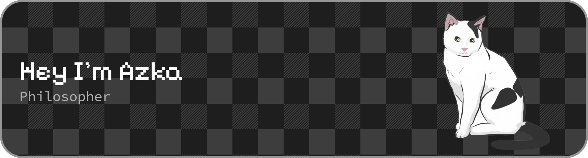

  

 

  
  
  
  

  

  

  

## My favorite tools and technologies

> Tools and technologies that I have worked with and am interested in

<table width="100%" align="center">
  <tr>
    <td align="center">
       C#
    </td>
    <td align="center">
       Python
    </td>
    <td align="center">
       Javascript
    </td>
    <td align="center">
       C++
    </td>
    <td align="center">
       Django
    </td>
    <td align="center">
       Github
    </td>
    <td align="center">
       Rest API
    </td>
    <td align="center">
       Docker
    </td>
    <td align="center">
       Nginx
    </td>
  </tr>
  <tr>
    <td align="center">
       Git
    </td>
    <td align="center">
       GitLab
    </td>
    <td align="center">
       HTML
    </td>
    <td align="center">
       CSS
    </td>
    <td align="center">
       Bootstrap
    </td>
    <td align="center">
       Tailwind
    </td>
    <td align="center">
       JQuery
    </td>
    <td align="center">
       PostgreSQL
    </td>
    <td align="center">
       ASP.NET
    </td>
  </tr>
  <tr>
    <td align="center">
       Redis
    </td>
    <td align="center">
       Postman
    </td>
    <td align="center">
       Linux
    </td>
    <td align="center">
       Dart
    </td>
    <td align="center">
       RabbitMQ
    </td>
    <td align="center">
       Sentry
    </td>
    <td align="center">
       Celery
    </td>
    <td align="center">
       Docusaurus
    </td>
    <td align="center">
       Pytest
    </td>
  </tr>
</table>
